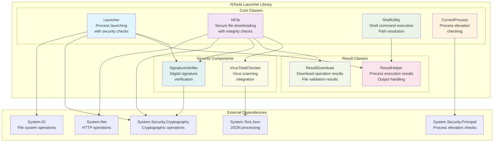

# NTools Launcher Architecture

This document provides a comprehensive overview of the NTools Launcher architecture, a .NET library that simplifies common tasks related to launching executables, downloading files, executing shell commands, and checking process elevation.

## Overview

NTools Launcher is a NuGet package library written in .NET that provides robust functionality for:

- **Process Launching**: Launch executables with digital signature verification
- **File Downloading**: Secure file downloads with integrity checks
- **Shell Command Execution**: Execute shell commands and retrieve results
- **Process Elevation Checking**: Determine if the current process is elevated
- **Security Features**: Digital signature verification, VirusTotal integration

## Architecture Diagram



## Core Components

### Launcher Class
- **Purpose**: Main class for launching processes with security features
- **Key Features**:
  - Process launching with optional digital signature verification
  - File locking during execution
  - Asynchronous process launching
  - Thread-safe operations
- **Methods**:
  - `LaunchAsync()` - Launch process asynchronously
  - `LaunchAndWait()` - Launch and wait for completion
  - `LockAndLaunch()` - Lock file and launch with verification

### NFile Class
- **Purpose**: Secure file downloading with integrity and security checks
- **Key Features**:
  - HTTP/HTTPS file downloads
  - Digital signature verification
  - File size validation
  - VirusTotal integration
  - Progress reporting
- **Methods**:
  - `DownloadAsync()` - Download file with all security checks
  - `ValidateSignature()` - Verify digital signatures
  - `CheckVirusTotal()` - Scan with VirusTotal

### ShellUtility Class
- **Purpose**: Execute shell commands and resolve file paths
- **Key Features**:
  - Command execution with output capture
  - Path environment variable resolution
  - Error handling and result reporting
- **Methods**:
  - `ExecuteCommand()` - Execute shell commands
  - `GetFullPath()` - Resolve full file paths from PATH

### CurrentProcess Class
- **Purpose**: Check process elevation status
- **Key Features**:
  - Windows administrator privilege detection
  - Cross-platform compatibility considerations
- **Methods**:
  - `IsElevated()` - Check if current process is elevated

## Security Components

### SignatureVerifier Class
- **Purpose**: Digital signature verification for executables and files
- **Key Features**:
  - Authenticode signature validation
  - Certificate chain verification
  - Timestamp validation
- **Dependencies**: System.Security.Cryptography.Pkcs

### VirusTotalChecker Class
- **Purpose**: Virus scanning integration with VirusTotal API
- **Key Features**:
  - API key authentication
  - File hash submission and scanning
  - Result parsing and reporting
- **Dependencies**: System.Net, System.Text.Json

## Result Classes

### ResultHelper Class
- **Purpose**: Handle results from process execution operations
- **Properties**:
  - `Code` - Exit code from executed process
  - `Output` - List of output lines
  - `Success` - Boolean success indicator
- **Methods**:
  - `GetFirstOutput()` - Get first line of output
  - `HasOutput()` - Check if output exists

### ResultDownload Class
- **Purpose**: Handle results from file download operations
- **Properties**:
  - `FileSize` - Size of downloaded file
  - `X509Certificate2` - Certificate if verified
  - `Code` - Result code
  - `Output` - Operation output
- **Methods**:
  - `IsSuccess()` - Check if download succeeded
  - `DisplayCertificate()` - Show certificate information

## File Structure

```
ntools-launcher/
├── ntools-launcher.sln           # Main solution file
├── Nbuild.bat                    # Build script
├── mkdocs.yml                    # Documentation configuration
├── README.md                     # Project documentation
├── targets.md                    # Build targets documentation
├── coverage.cobertura.xml        # Test coverage report
├── nbuild.targets                # MSBuild targets
├── unit-tests.targets            # Unit test targets
├── e2e-tests.targets             # E2E test targets
│
├── launcher/                     # Main library project
│   ├── Launcher.csproj
│   ├── Launcher.cs               # Main Launcher class
│   ├── NFile.cs                  # File download functionality
│   ├── ShellUtility.cs           # Shell command execution
│   ├── CurrentProcess.cs         # Process elevation checking
│   ├── ResultHelper.cs           # Process result handling
│   ├── ResultDownload.cs         # Download result handling
│   ├── SignatureVerifier.cs      # Digital signature verification
│   └── VirusTotalChecker.cs      # VirusTotal integration
│
├── LauncherTest/                 # Test project
│   ├── LauncherTest.csproj
│   └── LauncherTest.cs           # Basic tests
│
├── LauncherTests/                # Comprehensive test suite
│   ├── LauncherTests.csproj
│   ├── LauncherTests.cs          # Launcher class tests
│   ├── NFileTests.cs             # NFile class tests
│   ├── ResultDownloadTests.cs    # ResultDownload tests
│   ├── ResultHelperTests.cs      # ResultHelper tests
│   ├── ShellUtilityTests.cs      # ShellUtility tests
│   ├── SignatureVerifierTests.cs # SignatureVerifier tests
│   └── VirusTotalCheckerTests.cs # VirusTotalChecker tests
│
├── docs/                         # Documentation
│   ├── index.md
│   ├── installation.md
│   ├── usage.md
│   ├── devguide/
│   │   ├── setup.md
│   │   ├── dependencies.md
│   │   ├── build-and-test.md
│   │   └── targets.md
│   └── revisions/
│
└── .github/                      # GitHub configuration
    ├── workflows/
    │   └── dotnet-desktop.yml    # CI/CD pipeline
    └── validation/               # Configuration validation
```

## Dependencies

### Runtime Dependencies
- **.NET 10.0**: Target framework for execution
- **Windows OS**: Primary platform support
- **Internet Access**: Required for VirusTotal API and file downloads

### Development Dependencies
- **MSTest v4.0.2**: Testing framework
- **Microsoft.NET.Test.Sdk v18.0.1**: Test SDK
- **System.Security.Cryptography.Pkcs v10.0.1**: Cryptographic operations
- **System.Text.Json v10.0.1**: JSON processing
- **System.Security.Principal.Windows v5.0.0**: Process elevation checks

## Security Considerations

### Digital Signature Verification
- All executable launches can optionally verify Authenticode signatures
- Certificate chain validation ensures trust hierarchy
- Timestamp validation prevents replay attacks

### File Download Security
- HTTPS-only downloads (configurable)
- File hash verification against known good values
- VirusTotal integration for malware detection
- File size validation to prevent resource exhaustion

### Process Elevation
- Secure checking of administrator privileges
- No elevation escalation - only detection
- Cross-platform considerations for future expansion

## Testing Strategy

### Unit Tests
- Comprehensive test coverage for all public methods
- Mock external dependencies (VirusTotal API, file system)
- Test both success and failure scenarios
- Parallel test execution with `[DoNotParallelize]` where needed

### Integration Tests
- End-to-end process launching scenarios
- Real file download testing (with safe URLs)
- Shell command execution validation

### Security Testing
- Digital signature validation testing
- Certificate chain testing
- VirusTotal API integration testing

## Build and Deployment

### Build Process
- MSBuild-based compilation using nbuild system
- Multi-target framework support (.NET 10.0)
- NuGet package generation for distribution
- Test execution with coverage reporting

### Distribution
- **NuGet Package**: `ntools-launcher` on nuget.org
- **GitHub Releases**: Source code and documentation
- **Documentation Site**: MkDocs-generated static site

## Future Enhancements

### Platform Support
- Linux and macOS support expansion
- Cross-platform process launching
- Platform-specific security features

### Feature Additions
- Additional antivirus integrations
- Advanced process monitoring
- Download resume capabilities
- Batch operation support

### Performance Optimizations
- Async operation improvements
- Memory usage optimization
- Concurrent download support</content>
<parameter name="filePath">c:\source\ntools-launcher\docs\architecture.md